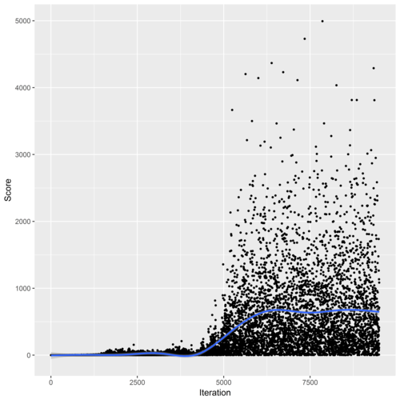

# Machine Learning Engineer Nanodegree
## Capstone Proposal
Bruno Belluomini
June 27th, 2019

## Proposal
### Domain Background

Flappy Bird is a mobile game created by the vietnamese programmer Dong Nguyen and released in 2013 which became much popular in 2014. The game consists in making a little bird
fly through pipes without touching them. If the bird touches the pipe, you lose. The player has two actions: tapping the screen, which makes the bird flaps upward the screen, or not, which makes the bird fall. 

  

<i>Flappy Bird game as implemented by sourabhv (source: https://github.com/sourabhv/FlapPyBird)
</i>

The game is not that easy and I found myself scoring less than 10 most of times. With reinforcement learning algorithms I could train an agent that could certainly scores way better than me.

Since I love videogames since childhood and I want to improve my knowledge at reinforcement learning this could be a very good challenge for me.

### Problem Statement

This project consists in train an agent to score as high as possible in Flappy Bird game using Temporal-Difference Reinforcement Learning Methods. The idea here is to benchmark
three algorithms we've seen in the nanodegree course, Sarsa, Sarsamax (or Q-Learning)(ε-greedy policy) and Expected Sarsa, and check which one has the best performance. Further information
will be described in the _Solution Statement_ and _Benchmark Model_ sections below.

### Datasets and Inputs

In Flappy Bird game we have a continuous state space and an action space with the size of 2 (for the actions `flap` and `dont_flap` which we'll denote here as `1` and `0` respectively). To reduce the complexity and the state space we will discretize it to make tiles. We'll use 3 game inputs to train our agent:

* Vertical Velocity - The bird fall in the game is accelerated and is determinant to decide whether `flap` or `dont_flap`
* Vertical Distance to the Next Pipe - The difference *in number of tiles* between the bird's current tile and the next pipe tile in the vertical axis
* Horizontal Distance to the Next Pipe - The difference *in number of tiles* between the bird's current tile and the next pipe tile in the horizontal axis

For the game itself we'll use a modified version of [FlapPy game clone of sourabhv](https://github.com/sourabhv/FlapPyBird) as all the game's logic is already implemented in Python. Those modifications will be very similar to the one made by chncyhn (https://github.com/chncyhn/flappybird-qlearning-bot).

### Solution Statement

Similarly to what we've had done in the _Temporal-Difference Methods_ in the Reinforcement Learning Section of the Nanodegree, we'll train our agent using those three algorithms, Sarsa, Q-Learning (ε-greedy policy) and Expected Sarsamax (ε-greedy policy). 

To reduce the dimentionality of the continuous state space, we'll discretize it  using an uniform grid of 5x5 pixels distance.

Our action space will be the set of `[1, 0]`, where `1` is `flap` and `0` is `dont_flap`.

The reward function will be designed as follows:

* +1 if the agent is alive after taking an action
* -100000 if the agent is dead after taking an action

We will run each of the three training algorithms for 10000 episodes.

### Benchmark Model

Our benchmark model will be the Q-Learning implementation made by chncyhn. He modelled the problem
in a very similar way and used a very similar algorithm (Q-Learning instead of Q-Learning with ε-greedy policy).

Speaking with numbers, he reached an average score of around 675 after the convergence, so we'll try to reach this number as far as possible.

### Evaluation Metrics

Our evaluation metric will be the **average game score for the last 100 episodes**.

### Project Design

Here are the steps for this project:

#### 1 - Sarsa, Sarsamax (with ε-greedy policy) and Expected Sarsa (with ε-greedy policy) algorithms implementation

We will take our course's implementation as example and generalizes them for any environment (not just Open AI's Gym).

#### 2 - Make the environment

Although we'll use an already implement version of Flappy Bird game in Python, it's implemented for a human to play, not for a Reinforcement Learning work. So our work
here is to make the game environment so that our agent can interact with.

#### 3 - Model training and evaluation

After we'll implement the three algorithms we'll use and make the game environment  we'll use a Jupyter notebook to train and evaluate our agents.
For the evaluaton part we'll colect both the game score for each episode and the average score for each 100 episodes and plot, like the example below:

  

<i>Example of model evaluation made by chncyhn (source: https://github.com/chncyhn/flappybird-qlearning-bot)
</i>