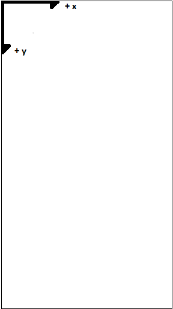
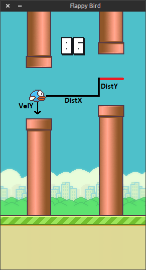
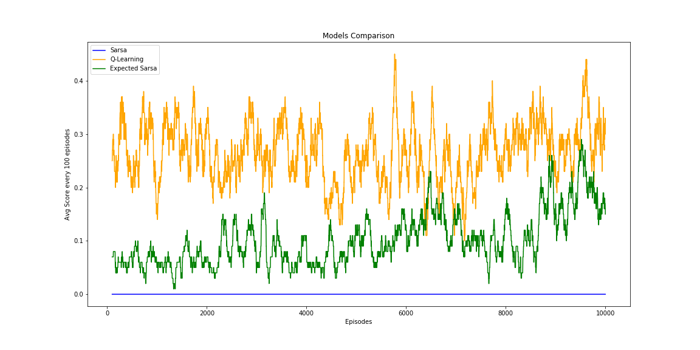
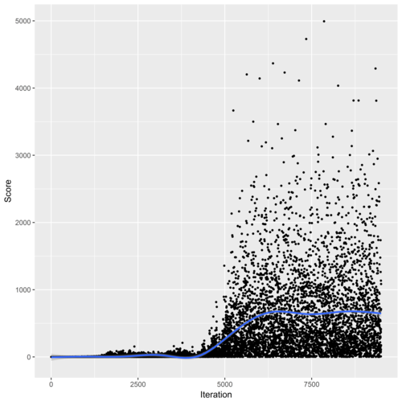
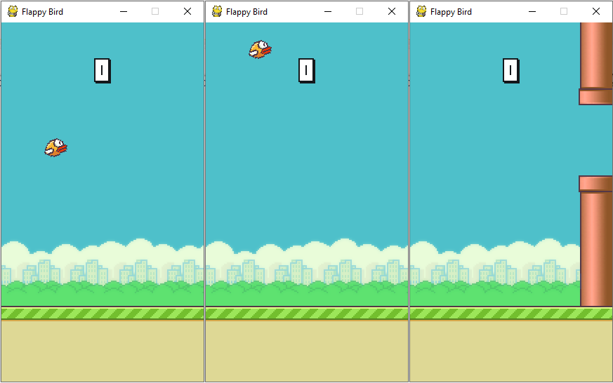

# Machine Learning Engineer Nanodegree
## Capstone Project
Bruno Belluomini  
July 3rd, 2019

## I. Definition

### Project Overview
Flappy Bird is a mobile game created by the vietnamese programmer Dong Nguyen and released in 2013 which became much popular in 2014. The game consists in making a little bird
fly through pipes without touching them or the ground. If the bird touches either the pipe or the ground, you lose. The player has two actions: tapping the screen, which makes the bird flaps upward the screen, or not, which makes the bird fall. 

<p align="center">
  
</p>

<center><i>Flappy Bird game as implemented by sourabhv (source: https://github.com/sourabhv/FlapPyBird)</center></i>

This project has a goal to use three Reinforcement Learning algorithms, Sarsa, Sarsamax (ε-greedy policy)(hereafter refered as Q-Learning (ε-greedy policy)) and Expected Sarsa (ε-greedy policy) to teach an agent how to play Flappy Bird.

### Problem Statement
In Flappy Bird game we have a continuous state space and an action space with the size of 2 (for the actions `flap` and `dont_flap` which we'll denote here as `1` and `0` respectively). To reduce the complexity and the state space we will discretize it to make tiles. We'll use 3 game inputs to train our agent:

* Horizontal Distance to the Next Pipe **(DistX)** - The difference *in number of tiles* between the bird's current tile and the next pipe tile in the horizontal axis
* Vertical Distance to the Next Gap Between Pipes (hereafter refered as _MidGap_) **(DistY)** - The difference *in number of tiles* between the bird's current tile and the next mid gap between pipes tile in the vertical axis
* Vertical Velocity **(VelY)**- The bird fall in the game is accelerated and is determinant to decide whether `flap` or `dont_flap`

We'll then map the states using those three features, `DistX`, `DistY` and `VelY`. The state
will be the string `"DistX_DistY_VelY"`.

For the reward function, we want to heavily penalize when the player loses, give a generous reward
when the vertical distance `DistY` is 0 (which means the bird is on the same vertical position as the gap between the pipes, where it should flies throught) and give a standard reward based on the vertical distance.

### Metrics
We can only achieve the project goal by measuring the game score itself, the higher the score the better as the agent went further in its gameplay. So in this project our evaluation metric will be the **average game score for the last 100 episodes** (hereafter denoted by _AvgScore<sub>100</sub>_).

## II. Analysis

### Data Exploration
As mentioned in the `Problem Statement` section, the Flappy Bird game environment consists in a
continuous state space with two possible actions. 

For a better understanding of the state space the game screen has 512 height x 288 width. The bird has a fixed X position during the game and the ground has base position of 107 height, which makes the total space state of 405 vertical positions in which the bird is still alive. 
The vertical velocity (`VelY`) is also a game input, and it ranges from -9 to 10, which makes the velocity space the size of 20. The negative signal in the velocity is due to the axis origin on the upper left corner of the screen.

<p align="center">
  
</p>

<center><i>Game reference system with origin on the upper left corner</center></i>

Finally, the game's state space is 405 (vertical positional space) * 230 (horizontal positional space) * 20 (velocity space) = **1,863,000 possible states**.

As for the action space we only have 2 options: `0` (don't flap) or `1` (flap). If the player choses `1` then its vertical velocity will instantly switch to the default vertical acceleration of `-9` (which is the minimal vertical velocity) and then it starts to increase for `+1` each step that the player doesn't flap.

### Exploratory Visualization
Here is an example of the three state space components `DistX`, `DistY` and `VelY`:


<p align="center">
  
</p>

<center><i>Flappy Bird features example. The red line is the reference line for the next pipe</center></i>

### Algorithms and Techniques

#### Algorithms

For the algorithms we will use the _Temporal-Difference Methods_ ones which we
have learned in the Nanodegree: Sarsa, Q-Learning (ε-greedy policy) and Expected Sarsa (ε-greedy policy).
As the Flappy Bird game has some repetition in the way it works, it could be a good idea
to use RL algorithms which learn from each iteration, not only when the episode ends, and the
TD algorithms have this ability.

#### Space Discretization

In order to reduce the dimensionality of our states we'll use the Space Discretization
technique. We will divide the space into 10x10 pixels tiles and use the resulted grid
to compose the state. 

### Benchmark

Our benchmark model will be the Q-Learning implementation made by chncyhn ([https://github.com/chncyhn/flappybird-qlearning-bot](https://github.com/chncyhn/flappybird-qlearning-bot)). He modelled the problem
in a very similar way and used a very similar algorithm (Q-Learning instead of Q-Learning with ε-greedy policy).

Speaking with numbers, he reached an average score of around 675 after the convergence, so we'll try to reach this number as far as possible.

## III. Methodology

### Data Preprocessing

As mentioned in the _Algorithms and Techniques_ above, the data preprocessing we have in this project is the _space discretization_ of the state space. 

Recall that our state space, if taken no preprocessing, would have:

<center> (512 - 107) * (288 - 58) * 20 = 1,863,000 possible states</center>
<center><i>(height - floor position) * (width - base x position) * velocities </i></center>

This amount of spaces will make the chosen algorithms to take a long amount of time to converge to a solution. To solve this problem we will reduce the state space using a _space discretization_ technique by making 10x10 tiles.


<p align="center">
  
</p>
<center><i>Space discretization example. Each grid is 10x10 wide</center></i>

With the space discretization the game state space will become as follows:

<center> (512 - 107)/ 10 * (288 - 58)/ 10 * 20 = 18,630 possible states</center>
<center><i>(height - floor position) * (width - base X position) * velocities </i></center>

This will reduce our game's state space from 1,863,000 to 18,630 possible states, a reduction of 99%. Further implementation details can be found at the _Implementation - Space Discretization_ section below.

### Implementation

#### Algorithms

All three algorithms implementations aimed to be as generic as possible, agnostic to the project problem (Flappy Bird game) so they can be used in other reinforcement learning problems as well. They are implemented in the `agent.py` file.

##### Sarsa

```Python
class Sarsa:


    def __init__(self, action_space, epsilon=1.0, force_training=False):
        self.action_space = action_space
        self.Q = self.load_q_values(force_training)
        self.epsilon = epsilon
        self.alpha = 0.15
        self.gamma = 1.00


    def learn(self, env):
        state = env.get_state()
        epsilon_greedy_policy = make_epsilon_greedy_policy(
            self.action_space, 
            self.Q[state], 
            self.epsilon
        )
        action = choose_action_from_policy(self.action_space, epsilon_greedy_policy)

        while True:
            next_state, reward, done = env.step(action)
            epsilon_greedy_policy = make_epsilon_greedy_policy(
                self.action_space, 
                self.Q[next_state], 
                self.epsilon
            )
            next_action = choose_action_from_policy(self.action_space, epsilon_greedy_policy)
            Q_current_action = self.Q[state][action]
            Q_next_action = self.Q[next_state][next_action]
            self.Q[next_state][next_action] = update_Q_values(
                self.alpha,
                reward,
                self.gamma,
                Q_current_action,
                Q_next_action
            )
            state = next_state
            action = next_action

            if done:
                break


    def act(self, state):
        epsilon_greedy_policy = make_epsilon_greedy_policy(
            self.action_space, 
            self.Q[state], 
            self.epsilon
        )
        action = choose_action_from_policy(self.action_space, epsilon_greedy_policy)

        return action


    def load_q_values(self, force_training):
        if force_training or not os.path.exists('sarsa_q_values.json'):
            return defaultdict(lambda: [0 for action in range(self.action_space)])
        else:
            q_values_file = open('sarsa_q_values.json', 'r')
            q_values = json.load(q_values_file)
            q_values_file.close()

            return defaultdict(lambda: [0 for action in range(self.action_space)], q_values)


    def save_q_values(self):
        q_values_file = open('sarsa_q_values.json', 'w')
        json.dump(dict(self.Q), q_values_file)
        q_values_file.close()
```

---

##### Q-Learning (ε-greedy policy)

```Python
class QLearning:


    def __init__(self, action_space, epsilon=1.0, force_training=False):
        self.action_space = action_space
        self.Q = self.load_q_values(force_training)
        self.epsilon = epsilon
        self.alpha = 0.15
        self.gamma = 1.00


    def learn(self, env):
        state = env.get_state()

        while True:
            epsilon_greedy_policy = make_epsilon_greedy_policy(
                self.action_space, 
                self.Q[state], 
                self.epsilon
            )
            action = choose_action_from_policy(self.action_space, epsilon_greedy_policy)
            next_state, reward, done = env.step(action)
            max_Q_a = np.max(
                [self.Q[next_state][next_action] for next_action in np.arange(self.action_space)]
            )
            self.Q[state][action] = update_Q_values(
                self.alpha,
                reward,
                self.gamma,
                self.Q[state][action],
                max_Q_a
            )
            state = next_state

            if done:
                break


    def act(self, state):
        epsilon_greedy_policy = make_epsilon_greedy_policy(
            self.action_space, 
            self.Q[state], 
            self.epsilon
        )
        action = choose_action_from_policy(self.action_space, epsilon_greedy_policy)

        return action


    def load_q_values(self, force_training):
        if force_training or not os.path.exists('q_learning_q_values.json'):
            return defaultdict(lambda: [0 for action in range(self.action_space)])
        else:
            q_values_file = open('q_learning_q_values.json', 'r')
            q_values = json.load(q_values_file)
            q_values_file.close()

            return defaultdict(lambda: [0 for action in range(self.action_space)], q_values)


    def save_q_values(self):
        q_values_file = open('q_learning_q_values.json', 'w')
        json.dump(dict(self.Q), q_values_file)
        q_values_file.close()
```

---

##### Expected Sarsa (ε-greedy policy)

```Python
class ExpectedSarsa:


    def __init__(self, action_space, epsilon=1.0, force_training=False):
        self.action_space = action_space
        self.Q = self.load_q_values(force_training)
        self.epsilon = epsilon
        self.alpha = 0.15
        self.gamma = 1.00


    def learn(self, env):
        state = env.get_state()

        while True:
            epsilon_greedy_policy = make_epsilon_greedy_policy(
                self.action_space, 
                self.Q[state], 
                self.epsilon
            )
            action = choose_action_from_policy(self.action_space, epsilon_greedy_policy)
            next_state, reward, done = env.step(action)
            next_policy = make_epsilon_greedy_policy(
                self.action_space, 
                self.Q[next_state], 
                self.epsilon
            )
            expected_Q = np.dot(self.Q[next_state], next_policy)
            self.Q[state][action] = update_Q_values(
                self.alpha,
                reward,
                self.gamma,
                self.Q[state][action],
                expected_Q
            )
            state = next_state

            if done:
                break


    def act(self, state):
        epsilon_greedy_policy = make_epsilon_greedy_policy(
            self.action_space, 
            self.Q[state], 
            self.epsilon
        )
        action = choose_action_from_policy(self.action_space, epsilon_greedy_policy)

        return action


    def load_q_values(self, force_training):
        if force_training or not os.path.exists('expected_sarsa_q_values.json'):
            return defaultdict(lambda: [0 for action in range(self.action_space)])
        else:
            q_values_file = open('expected_sarsa_q_values.json', 'r')
            q_values = json.load(q_values_file)
            q_values_file.close()

            return defaultdict(lambda: [0 for action in range(self.action_space)], q_values)


    def save_q_values(self):
        q_values_file = open('expected_sarsa_q_values.json', 'w')
        json.dump(dict(self.Q), q_values_file)
        q_values_file.close()
```


There are three common methods between those three algorithms, `make_epsilon_greedy_policy`, `choose_action_from_policy` and `update_Q_values`, implemented as follows:

```Python
def make_epsilon_greedy_policy(action_space_size, Q_state, epsilon):
    epsilon = max(epsilon, 0.10)
    policy_state = np.ones(action_space_size) * epsilon / action_space_size
    policy_state[np.argmax(Q_state)] = 1 - epsilon + (epsilon / action_space_size)

    return policy_state


def choose_action_from_policy(action_space, policy):
    available_actions = np.arange(action_space)

    return np.random.choice(available_actions, p=policy)


def update_Q_values(alpha, reward, gamma, Q_current_action, Q_next_action):
    return Q_current_action + alpha * (reward + gamma * Q_next_action - Q_current_action)
```

---

#### Reward Function

For the reward function, our goal is to make the bird fly throught the middle of the gap between pipes, thus improving our game score. 

The idea is to heavily penalize the agent when it colides with either the floor or a pipe but it also is greatly rewarded when it scores a game point.
The agent is also lightly penalized if the difference between the bird and the MidGap is equal or greater than 2 tiles, else it lightly receives a reward.

The reward function is implemented as follows:

```Python
def get_reward(self, collision, next_state):
    vertical_pos_diff = int(next_state.split('_')[1])

    if collision:
        return -10000

    elif self.has_scored:
        return 1000

    elif abs(vertical_pos_diff) >= 2:
        return -10    

    else:
        return 10
```

#### Space Discretization
The discretization will be implemented in file `environment.py` as follows:

```Python
def create_uniform_grid(width, height):
    """
    Create grids of 10x10 pixels
    """
    grid_size = (10, 10)
    num_bins_horizontal = int(round(width / grid_size[0]))
    num_bins_vertical = int(round(height / grid_size[1]))
    bins = (num_bins_horizontal, num_bins_vertical)
    low = [0, 0]
    high = [width, height]
    grid = [np.linspace(low[dim], high[dim], bins[dim] + 1)[1:-1] for dim in range(len(bins))]

    return grid


def map_position_tile(position, grid):
    """
    Map some position acording to the discretized game space
    Input: position (list): List with position [x, y]
    Output: grid (list): Tile which matches the given position for a given grid
    """
    return list(int(np.digitize(p, g)) for p, g in zip(position, grid))
```

#### State Mapping

Recall that the state in this project will be mapped in function of three state features: 

* `DistX`: The horizontal distance (in tile grids) between the bird and the next MidGap
* `DistY`: Vertical distance between the bird and the MidGap
* `VelY`: The current vertical velocity of the bird

Our state will be the string `"DistX_DistY_VelY"`. The state mapping function `get_state` is implemented in file `environment.py` as follows:

```Python
def get_state(self):
    if self.lower_pipes[0]['x'] - self.bird_pos_x > -30:
        pipe = self.lower_pipes[0]
    else:
        pipe = self.lower_pipes[1]

    bird_tile_pos = map_position_tile([self.bird_pos_x, self.bird_pos_y], self.game_grid)
    mid_pipe_gap_tile_pos = map_position_tile([pipe['x'], pipe['y'] + self.pipe_gap_size / 2], self.game_grid)
    pos_difference = np.subtract(mid_pipe_gap_tile_pos, bird_tile_pos)

    return f"{pos_difference[0]}_{pos_difference[1]}_{self.bird_vel_y}"
```


#### Evaluation Metric

The evaluation metric for this project is the _AvgScore<sub>100</sub>_ as mentioned in the section _I - Definition - Metrics_ above. This is simply calculated as:

$$AvgScore_{100} = {1}/{100}*\sum_{episode=1}^{100} GameScore_{episode}$$


### Refinement

All three algorithms are trained with the same parameters, explained below:

* Learning Rate ($\alpha$): **0.15**
As Flappy Bird game has a deterministic behavior in regard of whether flap or not, setting a small value for $\alpha$ is reasonable in order to avoid our agent to unlearn some good movement.

* Discount Rate ($\gamma$): **1.00**
Similarly to the learning rate, the $\gamma$ is set to 1,0 to avoid agent to learn some unexpected movement in order to prioritize the immediate reward.

* Exploration-Exploitation Rate ($\epsilon$): **max(1 - (0.045 * n_episode), 0.10)**
We set the $\epsilon$ value by starting with 1.0 and decaying linearly until it reaches 0.10 over the first 2% of the number of trained episodes and fixed at 0.10 thereafter based on [Human-level control through deep reinforcement learning](https://storage.googleapis.com/deepmind-media/dqn/DQNNaturePaper.pdf) research paper

* Number of Episodes: **10,000**
Based on the benchmark model which reached its convergence at 10,000 episodes.

## IV. Results

### Model Evaluation and Validation

Here are the training results:

<p align="center">
  
</p>
<center><i>AvgScore100 x Episodes curve. Q-Learning reached the best score among them</center></i>


The Q-Learning algorithm reached the best $AvgScore_{100}$ throught all episodes. By the episode 8000, the Expected Sarsa agent begins to increase its metric quicker than Q-Learning, maybe with more episodes Expected Sarsa could surpass Q-Learning. Also, notice that Sarsa agent did not scored in any played episode.

### Justification

Here are the final scores ($AvgScore_{100}$ for the last 100 episodes) for each agent as well the benchmark model one:


| - | Sarsa | Q-Learning (ε-greedy policy) | Expected Sarsa (ε-greedy policy) | Benchmark Model |
|---|-------|------------------------------|----------------------------------|-----------------|
| $AvgScore_{100}$ | 0.0   | 0.30          | 0.15                             | 675             |

None of our agents could match at least $AvgScore_{100} = 1$  in the end, which make them far inferior than the benchmark model.

Here is the AvgScore100 x Episodes curve for the Benchmark Model:

<p align="center">
  
</p>
<center><i> AvgScore100 x Episodes curve for the Benchmark Model (source: https://github.com/chncyhn/flappybird-qlearning-bot).</center></i>


Notice that benchmark model converges by the iteration (episode) 6200 and the $AvgScore_{100}$ curve (the <span style="color:blue">blue one</span>) is much smoother than ours, which probably means that not only the model is way better (it reaches higher scores) but it is also much more consistent with their game results.


## V. Conclusion

### Free-Form Visualization

<p align="center">
  
</p>
<center><i>Q-Learning agent playing after training.</center></i>

The image above represents the most common behavior from our best agent (Q-Learning) when it plays after training: the bird keeps flapping until it reaches the pipe and then it's game over.

It is curious because one of the reward conditions penalizes when the bird is higher than it was supposed to be, but the agent has not learned that it should keep the MidPipe high.


### Reflection

The following steps summarizes this project:

1) Adapt the sourabhv's Flappy Bird Python implementation so that I could train the agents (source: [https://github.com/sourabhv/FlapPyBird)](https://github.com/sourabhv/FlapPyBird) 
2) Adapt the Nanodegree's TD-Learning algorithms implementation so they could be able to both learn and play after with the learned movements
3) Implement the environment by adapting the game itself to be more generic and able to an agent make decisions
4) Design and implement a space state reduction using space discretization
5) Design a reward function that makes sense with the problem statement
6) Make a notebook (`Flappy Bird Training.ipynb`) with both training and evaluation

I found the step 2 particularly interesting because I needed to revisit some lessons in the Nanodegree to better undestand the algorithms so I could implement them properly.

The greatest challenge for me was in the step 5 when I was thinking in a good reward function that would solve the problem. Although the conditions make sense, the final results shown that either the reward function wasn't good or some implementation, either the environment or the agents, was not correct.

### Improvement

There are some improvements that we may consider for future works.

1) In Flappy Bird game the actions has no immediate consequences. Imagine if a player hit a bad flap in a moment. The consequence of that bad jump will only be suffered some moments later (say after 10 frames). To solve this, we could also implement a Replay Buffer to store some plays by the agent and then update the Q-values by revisiting them. This could probably improve a lot our metrics.

2) We can also use a more robust Reinforcement Learning algorithm which can handle very well with large continuous spaces, like Deep Q-Learning (DQL). This way the discretization cannot interfere in the agent training.
Besides, we can also change the state mapping for the game pixels itself with a more robust algorithm, this way we can avoid whatever problem with bad state mapping.