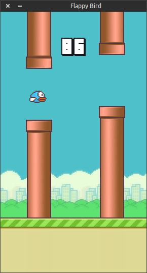

# Machine Learning Engineer Nanodegree
## Capstone Project
Bruno Belluomini  
July 3rd, 2019

## I. Definition

### Project Overview
Flappy Bird is a mobile game created by the vietnamese programmer Dong Nguyen and released in 2013 which became much popular in 2014. The game consists in making a little bird
fly through pipes without touching them or the ground. If the bird touches either the pipe or the ground, you lose. The player has two actions: tapping the screen, which makes the bird flaps upward the screen, or not, which makes the bird fall. 

<p align="center">
  
</p>

<center><i>Flappy Bird game as implemented by sourabhv (source: https://github.com/sourabhv/FlapPyBird)</center></i>

This project has a goal to use three Reinforcement Learning algorithms, Sarsa, Sarsamax (ε-greedy policy)(hereafter refered as Q-Learning (ε-greedy policy)) and Expected Sarsa (ε-greedy policy) to teach an agent how to play Flappy Bird.

### Problem Statement
In Flappy Bird game we have a continuous state space and an action space with the size of 2 (for the actions `flap` and `dont_flap` which we'll denote here as `1` and `0` respectively). To reduce the complexity and the state space we will discretize it to make tiles. We'll use 3 game inputs to train our agent:

* Horizontal Distance to the Next Pipe **(DistX)** - The difference *in number of tiles* between the bird's current tile and the next pipe tile in the horizontal axis
* Vertical Distance to the Next Gap Between Pipes **(DistY)** - The difference *in number of tiles* between the bird's current tile and the next mid gap between pipes tile in the vertical axis
* Vertical Velocity **(VelY)**- The bird fall in the game is accelerated and is determinant to decide whether `flap` or `dont_flap`

We'll then map the states using those three features, `DistX`, `DistY` and `VelY`. The state
will be the string `"DistX_DistY_VelY"`.

For the reward function, we want to heavily penalize when the player loses, give a generous reward
when the vertical distance `DistY` is 0 (which means the bird is on the same vertical position as the gap between the pipes, where it should flies throught) and give a standard reward based on the vertical distance.

### Metrics
We can only achieve the project goal by measuring the game score itself, the higher the score the better as the agent went further in its gameplay. So in this project our evaluation metric will be the **average game score for the last 100 episodes**.  

## II. Analysis

### Data Exploration
As mentioned in the `Problem Statement` section, the Flappy Bird game environment consists in a
continuous state space with two possible actions. 

For a better understanding of the state space the game screen has 512 height x 288 width. The bird has a fixed X position during the game and the ground has base position of 107 height, which makes the total space state of 405 vertical positions in which the bird is still alive. 
The vertical velocity (`VelY`) is also a game input, and it ranges from -9 to 10, which makes the velocity space the size of 18. The negative signal in the velocity is due to the axis origin on the upper left corner of the screen.

<p align="center">
  
</p>

<center><i>Game reference system with origin on the upper left corner</center></i>

Finally, the game's state space is 405 (positional space) * 19 (velocity space) = **7695 possible states**.

As for the action space we only have 2 options: `0` (don't flap) or `1` (flap). If the player choses `1` then its vertical velocity will instantly switch to the default vertical acceleration of `-9` (which is the minimal vertical velocity) and then it starts to increase for `+1` each step that the player doesn't flap.

### Exploratory Visualization
Here is an example of the three state space components `DistX`, `DistY` and `VelY`:


<p align="center">
  
</p>

<center><i>Flappy Bird features example. The red line is the reference line for the next pipe</center></i>

### Algorithms and Techniques

#### Algorithms

For the algorithms we will use the _Temporal-Difference Methods_ ones which we
have learned in the Nanodegree: Sarsa, Q-Learning (ε-greedy policy) and Expected Sarsa (ε-greedy policy).
As the Flappy Bird game has some repetition in the way it works, it could be a good idea
to use RL algorithms which learn from each iteration, not only when the episode ends, and the
TD algorithms have this ability.

#### Space Discretization

In order to reduce the dimensionality of our states we'll use the Space Discretization
technique. We will divide the space into 5x5 pixels tiles and use the resulted grid
to compose the state. This will reduce our game's state space from 7695 to 1539 possible states, 
a reduction of 80%.

### Benchmark

Our benchmark model will be the Q-Learning implementation made by chncyhn ([https://github.com/chncyhn/flappybird-qlearning-bot](https://github.com/chncyhn/flappybird-qlearning-bot)). He modelled the problem
in a very similar way and used a very similar algorithm (Q-Learning instead of Q-Learning with ε-greedy policy).

Speaking with numbers, he reached an average score of around 675 after the convergence, so we'll try to reach this number as far as possible.

## III. Methodology

### Data Preprocessing
In this section, all of your preprocessing steps will need to be clearly documented, if any were necessary. From the previous section, any of the abnormalities or characteristics that you identified about the dataset will be addressed and corrected here. Questions to ask yourself when writing this section:
- _If the algorithms chosen require preprocessing steps like feature selection or feature transformations, have they been properly documented?_
- _Based on the **Data Exploration** section, if there were abnormalities or characteristics that needed to be addressed, have they been properly corrected?_
- _If no preprocessing is needed, has it been made clear why?_

### Implementation

#### Algorithms

Their implementation can be found in the `agent.py` file.


#### Space Discretization
The discretization will be implemented as follows:

```Python
def create_uniform_grid(width, height):
    """
    Create grids of 5x5 pixels
    """
    grid_size = (5, 5)
    num_bins_horizontal = int(round(width / grid_size[0]))
    num_bins_vertical = int(round(height / grid_size[1]))
    bins = (num_bins_horizontal, num_bins_vertical)
    low = [0, 0]
    high = [width, height]
    grid = [np.linspace(low[dim], high[dim], bins[dim] + 1)[1:-1] for dim in range(len(bins))]

    return grid


def map_position_tile(position, grid):
    """
    Map some position acording to the discretized game space
    Input: position (list): List with position [x, y]
    Output: grid (list): Tile which matches the given position for a given grid
    """
    return list(int(np.digitize(p, g)) for p, g in zip(position, grid))
```

In this section, the process for which metrics, algorithms, and techniques that you implemented for the given data will need to be clearly documented. It should be abundantly clear how the implementation was carried out, and discussion should be made regarding any complications that occurred during this process. Questions to ask yourself when writing this section:
- _Is it made clear how the algorithms and techniques were implemented with the given datasets or input data?_
- _Were there any complications with the original metrics or techniques that required changing prior to acquiring a solution?_
- _Was there any part of the coding process (e.g., writing complicated functions) that should be documented?_


### Refinement
In this section, you will need to discuss the process of improvement you made upon the algorithms and techniques you used in your implementation. For example, adjusting parameters for certain models to acquire improved solutions would fall under the refinement category. Your initial and final solutions should be reported, as well as any significant intermediate results as necessary. Questions to ask yourself when writing this section:
- _Has an initial solution been found and clearly reported?_
- _Is the process of improvement clearly documented, such as what techniques were used?_
- _Are intermediate and final solutions clearly reported as the process is improved?_


## IV. Results
_(approx. 2-3 pages)_

### Model Evaluation and Validation
In this section, the final model and any supporting qualities should be evaluated in detail. It should be clear how the final model was derived and why this model was chosen. In addition, some type of analysis should be used to validate the robustness of this model and its solution, such as manipulating the input data or environment to see how the model’s solution is affected (this is called sensitivity analysis). Questions to ask yourself when writing this section:
- _Is the final model reasonable and aligning with solution expectations? Are the final parameters of the model appropriate?_
- _Has the final model been tested with various inputs to evaluate whether the model generalizes well to unseen data?_
- _Is the model robust enough for the problem? Do small perturbations (changes) in training data or the input space greatly affect the results?_
- _Can results found from the model be trusted?_

### Justification
In this section, your model’s final solution and its results should be compared to the benchmark you established earlier in the project using some type of statistical analysis. You should also justify whether these results and the solution are significant enough to have solved the problem posed in the project. Questions to ask yourself when writing this section:
- _Are the final results found stronger than the benchmark result reported earlier?_
- _Have you thoroughly analyzed and discussed the final solution?_
- _Is the final solution significant enough to have solved the problem?_


## V. Conclusion
_(approx. 1-2 pages)_

### Free-Form Visualization
In this section, you will need to provide some form of visualization that emphasizes an important quality about the project. It is much more free-form, but should reasonably support a significant result or characteristic about the problem that you want to discuss. Questions to ask yourself when writing this section:
- _Have you visualized a relevant or important quality about the problem, dataset, input data, or results?_
- _Is the visualization thoroughly analyzed and discussed?_
- _If a plot is provided, are the axes, title, and datum clearly defined?_

### Reflection
In this section, you will summarize the entire end-to-end problem solution and discuss one or two particular aspects of the project you found interesting or difficult. You are expected to reflect on the project as a whole to show that you have a firm understanding of the entire process employed in your work. Questions to ask yourself when writing this section:
- _Have you thoroughly summarized the entire process you used for this project?_
- _Were there any interesting aspects of the project?_
- _Were there any difficult aspects of the project?_
- _Does the final model and solution fit your expectations for the problem, and should it be used in a general setting to solve these types of problems?_

### Improvement
In this section, you will need to provide discussion as to how one aspect of the implementation you designed could be improved. As an example, consider ways your implementation can be made more general, and what would need to be modified. You do not need to make this improvement, but the potential solutions resulting from these changes are considered and compared/contrasted to your current solution. Questions to ask yourself when writing this section:
- _Are there further improvements that could be made on the algorithms or techniques you used in this project?_
- _Were there algorithms or techniques you researched that you did not know how to implement, but would consider using if you knew how?_
- _If you used your final solution as the new benchmark, do you think an even better solution exists?_

-----------

**Before submitting, ask yourself. . .**

- Does the project report you’ve written follow a well-organized structure similar to that of the project template?
- Is each section (particularly **Analysis** and **Methodology**) written in a clear, concise and specific fashion? Are there any ambiguous terms or phrases that need clarification?
- Would the intended audience of your project be able to understand your analysis, methods, and results?
- Have you properly proof-read your project report to assure there are minimal grammatical and spelling mistakes?
- Are all the resources used for this project correctly cited and referenced?
- Is the code that implements your solution easily readable and properly commented?
- Does the code execute without error and produce results similar to those reported?